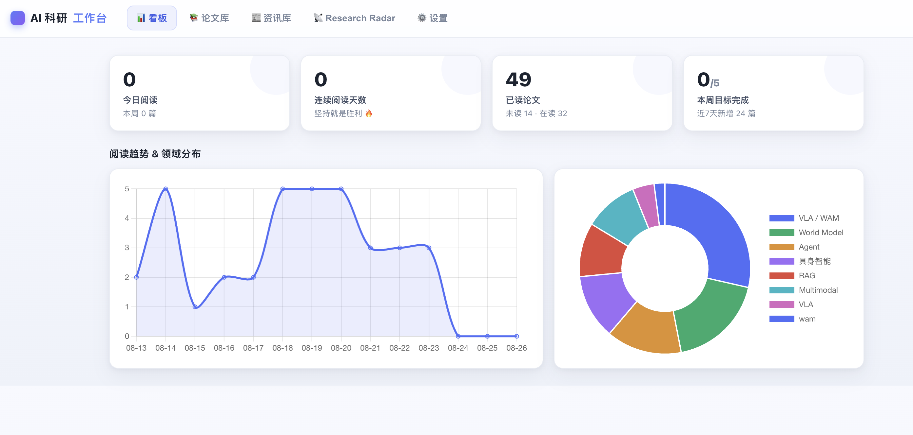
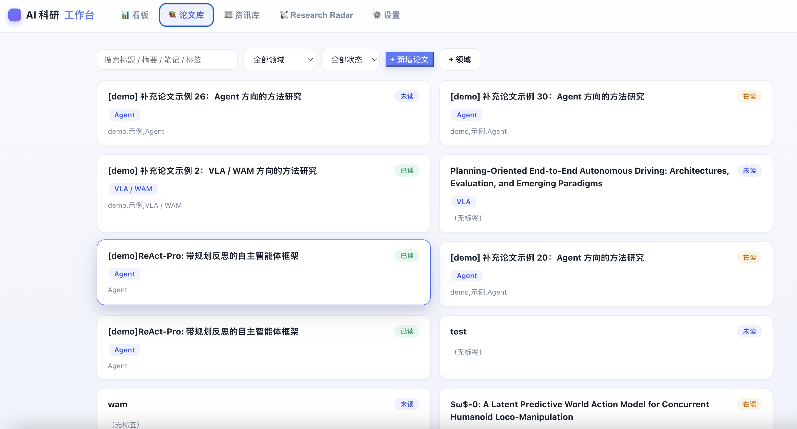
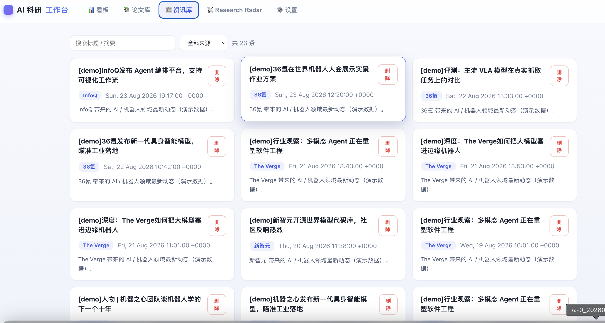
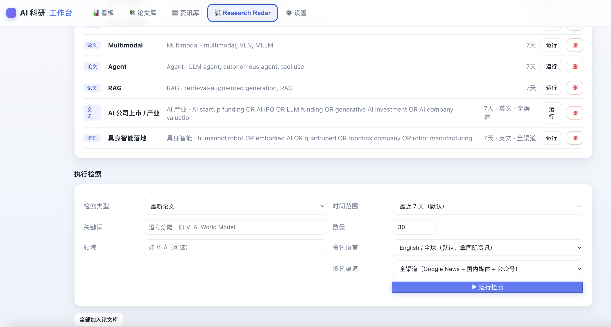
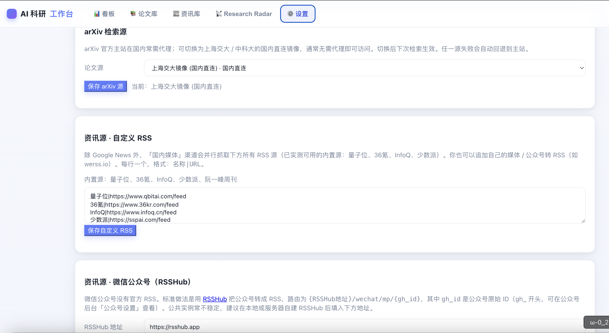

# AI 科研论文工作台 (ResearchBench)

面向研究生 / 科研工作者的个人论文管理工作台。闭环：**发现最新论文 → 一键收录 → 分类管理 → 阅读 → 记录笔记 → TeX 中文版生成飞书阅读文档 → 阅读统计与长期复盘**。

值得注意的是，本工作台 **90%** 的核心代码，都由 **workbuddy** 完成

## 界面预览

| 看板Dashboard | 论文库 |
|:---:|:---:|
|  |  |

| 资讯库 | Research Radar | 设置 |
|:---:|:---:|:---:|
|  |  |  |

## 设计理念：可独立使用，也支持 AI 增强

ResearchBench 的核心数据流（论文发现、收录、分类、阅读、笔记、TeX→飞书、统计）**无需任何外部 AI 服务即可完整运行**。arXiv 检索直连官方/镜像 API，资讯检索聚合 Google News 与国内 RSS，TeX 解析与飞书文档生成均为本地规则实现；API Key 仅用于可选的 AI 增强功能。同时，系统提供统一的 OpenAI 兼容接口配置，接入大模型或智能体后可用于论文总结、库内问答等场景，进一步提升信息处理的上限。

## 架构

## 五大模块

1. **论文库 (Paper Library)** — 分类字段管理、论文卡片 → **独立详情页**（渲染 Markdown 笔记/心得）、**编辑模式**与详情页分离、CRUD、搜索/筛选（关键词/领域/状态/标签）、URL 自动抓取元数据（按钮内联于「原文链接」行）、**笔记/心得支持 Markdown 编辑 + 实时预览 + 上传 .md 解析 + 粘贴飞书云文档链接导入**、**TeX 仓库改为文件夹上传**（`<input webkitdirectory>` 上传到 `data/tex_repos/{id}`，生成飞书文档时自动复用）。
2. **TeX → 飞书云文档工具** — 独立脚本 `tex2feishu.py`。不依赖 LLM：定位主 TeX 文件 → 展开 `\input`/`\include` → 解析章节/列表/公式/表格/图片 → 上传图片并按位置插入 → 写入同名飞书文档 → 返回链接并回写论文卡片。飞书凭证来自 `test_feishu_final_version.py` 的默认应用，也可在「设置-飞书」覆盖。
3. **Research Radar** — 手动/定时发现最新论文(arXiv)与 AI 资讯(Google News)。关键词+领域+时间范围配置、去重、标记「已在库中」、一键收录。**检索数据源为写死的 arXiv API + Google News RSS（不接 WorkBuddy AI）**；论文结果「加入论文库」，资讯结果「加入资讯库」。已内置 7 套默认模板（VLA/WAM、World Model、Multimodal、Agent、RAG、AI 产业、具身智能落地）。
4. **资讯库 (News Library)** — 独立 Tab，沉淀 Research Radar 检索到的 AI 资讯。仅做**只读沉淀**：卡片展示标题(链接)/来源/时间，支持搜索、按来源筛选、删除；**无修改/编辑功能**。数据来自 Radar 资讯检索「加入资讯库」或「全部加入资讯库」。
5. **阅读统计与督促** — 今日/本周/本月收录数、未读/在读/已读、连续阅读天数、领域分布、14 天趋势、每周目标进度（Chart.js 可视化）。
6. **AI 与自定义 API** — 统一的 API 配置页（Provider / Base URL / API Key / Model），后端 Fernet 加密存储，OpenAI 兼容。AI 能力（总结/库问答）在此配置后启用。

## 运行方式

```bash
# 1. 安装依赖（建议使用隔离 venv）
python -m venv venv && source venv/bin/activate
pip install -r requirements.txt

# 2. 启动后端（默认 127.0.0.1:8765）
python -m uvicorn app.main:app --host 127.0.0.1 --port 8765

# 3. 浏览器打开
http://127.0.0.1:8765
```

## 首次使用提示

- **飞书授权**：使用「TeX → 飞书」功能前，先在「设置-飞书」页点「授权」，浏览器完成 OAuth 后自动保存 token（位于 `data/feishu_token.json`，可自动刷新）。飞书应用默认用个人测试应用，建议在「设置-飞书」覆盖为自己的 App ID / Secret。
- **论文库**：先建「研究领域」分类，再录入论文；粘贴 arXiv / 网页链接可自动抓取标题摘要。
- **Research Radar**：首次检索需可访问外网（arXiv / Google News）。网络异常时接口返回 502 并给出明确提示，不会崩溃。
- **TeX → 飞书**：在论文卡片填入「TeX 仓库目录」本地路径，点「生成飞书文档」即可。

## 说明

- 后端 SQLite 数据库位于 `data/research.db`，首次启动自动建表并写入 7 套默认 Radar 模板。
- API Key 等敏感信息使用 Fernet 对称加密，密钥文件为 `data/.secret_key`（首次启动自动生成）。
- 前端为纯静态 SPA，无构建步骤；Chart.js 已本地化（`app/static/chart.umd.min.js`）以支持离线。
